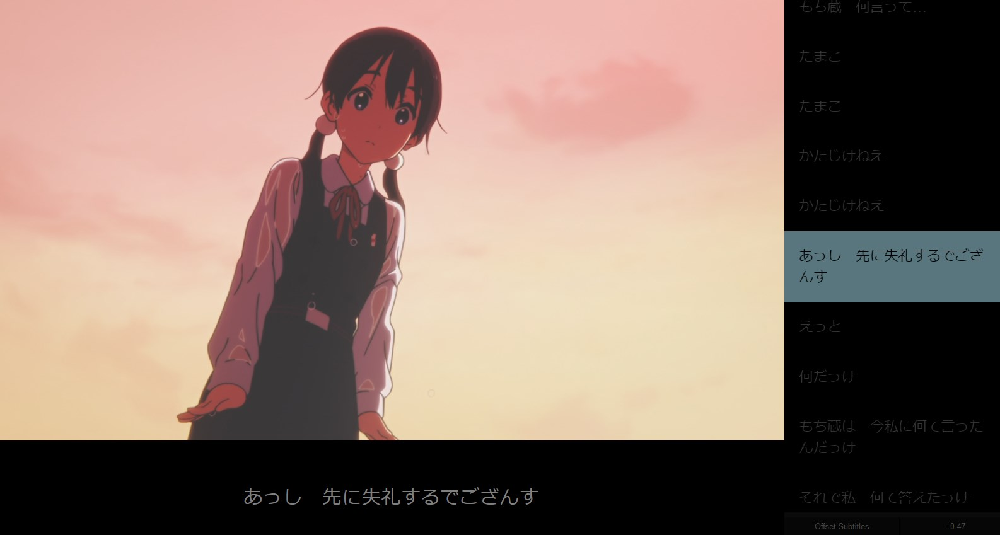

# Animebook
https://animebook.github.io

An HTML5 video player with navigable subtitles. Since subtitles are in the browser, you can quickly look up words using popup dictionaries like [yomichan](https://foosoft.net/projects/yomichan/).

This is a modified version of https://github.com/katspaugh/videobook, with some quality-of-life improvements to match the workflow described in https://www.animecards.site.
- Dark color scheme by default
- Resizable sidebar
- Ability to offset subtitles by a static time directly in the web player. Useful for the majority of subtitles on https://kitsunekko.net/ and https://itazuraneko.neocities.org/library/sub.html, which almost always need to be retimed to the video you're watching. Animebook can only offset when the subs start though, so for any retiming more complicated than that, you'll need to either regularly offset the subs while watching, or use the [alass scripts from animecards](https://www.animecards.site/#h.p_JJ4k20WaHvx2).
- App is a single html page, making it easier to download and save locally
